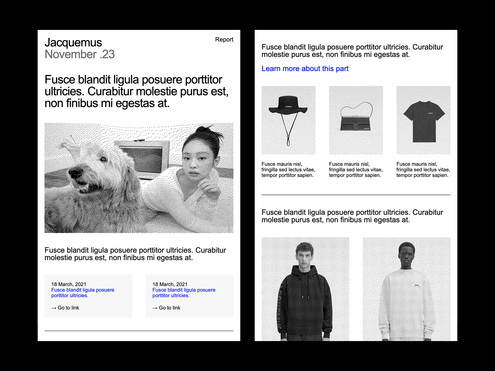

# Table-Based Responsive Email Template

HTML email template built for broad client compatibility, including Outlook. Layout is table-based, with MSO conditional comments where needed (wip). Tested across various email clients but not guaranteed to be bug-free.

## Sections

- Header
- Hero image
- Single-column text
- Two-column responsive text
- Three-column responsive with images
- Two-column responsive with images and CTA buttons
- Reversed two-column layout

## Usage

No dependencies. Just open `index.html` in a browser.

A [Tweakpane](https://tweakpane.info/) controller is included for live preview and quick adjustments. Remove the Tweakpane `<link>` and `<script>` tags before sending.

